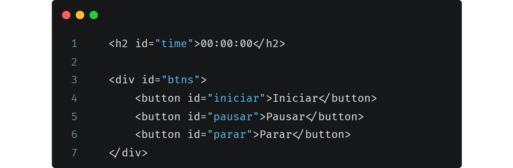
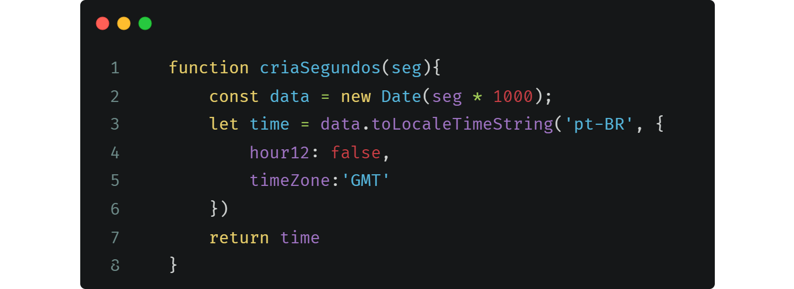
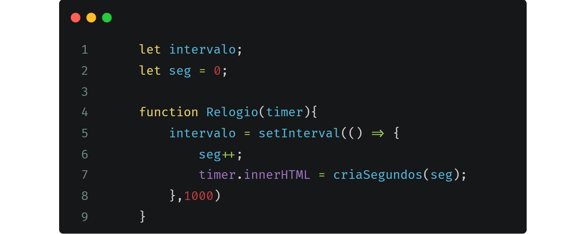
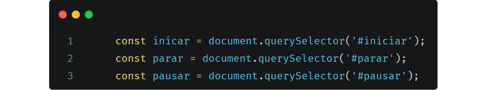
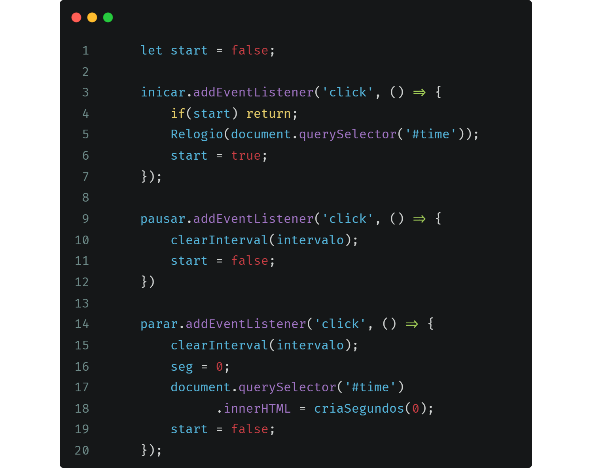
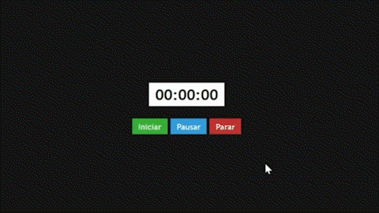

# Cronometro

## <b>HTML</b>

 

Possui um codigo html simples, apenas para inserir o display dos números, colocar os botões e centralizar tudo.

  

     

## <b>JavaScript</b>

 

Seu JavaScript possui duas partes, a primeira consiste em criar todo o código referente ao funcionamento do cronometro.

 

## <i>Primeira parte</i>

 

### | Função cria segundos

 
Esta função possui o papel de criar o timer refente aos segundos recebidos, utilizando o Objeto Date().

 

 

Esta função recebe como parametro seg, que se refere aos segundos desejados, como parametro do Date(), este seg é multiplicado por 1000 para adquirir os milissegundos, assim retornando, por exemplo, 00:00:01.

 

### | Função Relogio

 

Esta função possui o papel de criar o intervalo de tempo, após 1 segundo ela muda o HTML do timer para a string retornada pela função <i style="color: #A074C4;">criaSegundos()</i> que é passado como parametro os segundos da variável seg, após isso esta mesma variável é somada 1.

 

 

## <i>Segunda Parte</i>

 

### | Chamando o HTML

 

Para começar a segunda parte, chamei os botões do <b>HTML</b> usando o método <i style="color: #A074C4;">querySelector()</i>, pasando a ID respectiva.

 

 

### | Criando a interação

 

Para criar a interação utilizei o método <i style="color: #A074C4;">addEventListener()</i> para que ao clicar em cima do botão ele inicie, pause, ou pare o cronometro.

 

 

Para resolução de <b>bugs</b> tive que criar uma variavel chama start, cujo recebe um valor booleano, assim, quando clicar em iniciar mais de uma vez, não irá chamar a função <i style="color: #A074C4;">Relogio()</i>.

 

# Resultado

 

    

Link para o <a href="https://cronometro-ace.netlify.app">site</a> 
